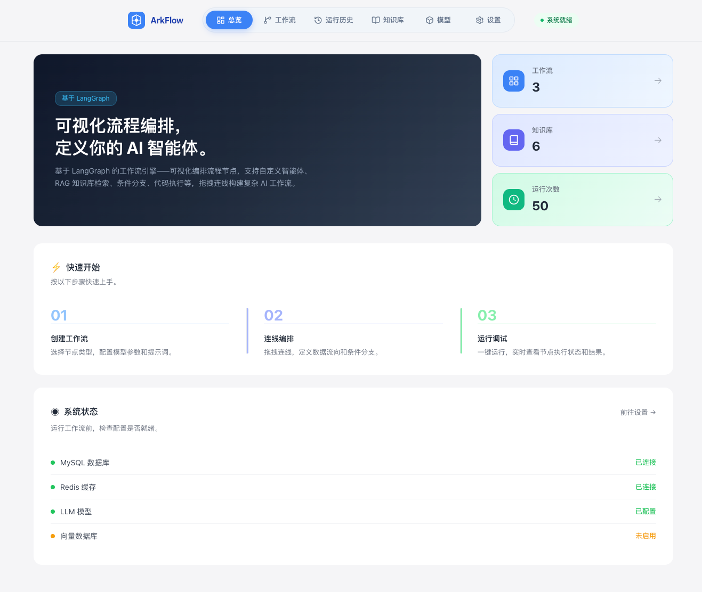
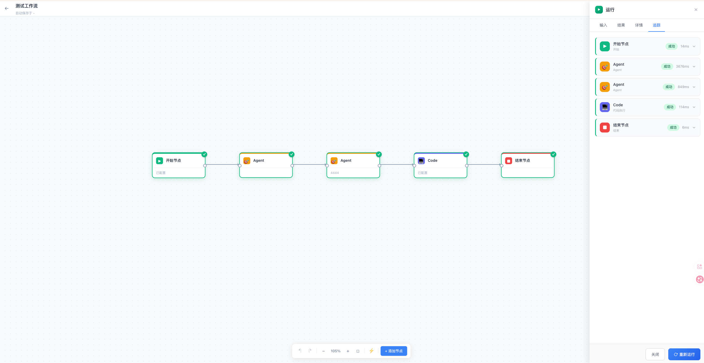
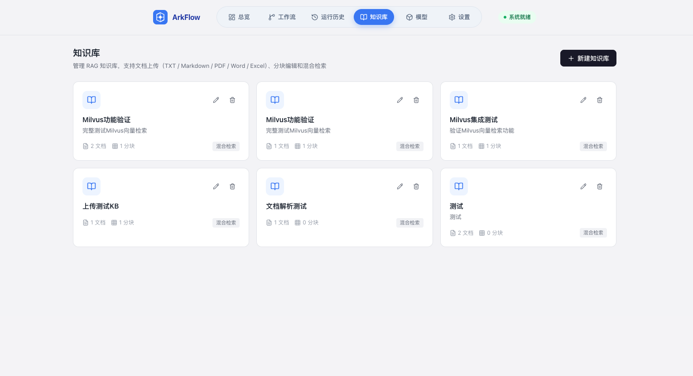
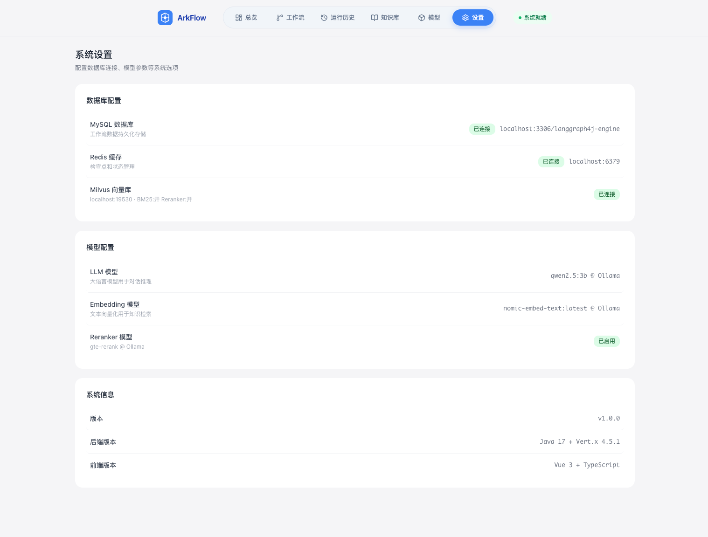

<div align="center">

# ArkFlow - 可视化 AI 工作流引擎

基于 LangGraph4J 的可视化 AI 工作流编排引擎，支持拖拽式节点编排、RAG 知识库、多路召回与实时执行监控。

[](https://www.oracle.com/java/)
[](https://vuejs.org/)
[](LICENSE)

[功能特性](#功能特性) · [快速开始](#快速开始) · [配置说明](#配置说明) · [API文档](#api文档) · [架构设计](#架构设计)

</div>

---

## 截图预览

### 工作流编排


### 运行监控


### 知识库管理


### 系统设置


## 功能特性

### 工作流编排
- **可视化拖拽画布** — 自由拖拽节点、连线编排数据流向
- **10+ 节点类型** — Start / End / LLM / Agent / Condition / Code / HTTP / Knowledge Retrieval / Template / Variable Assigner
- **Dagre 自动布局** — 一键整理节点布局
- **实时执行** — WebSocket 推送节点执行状态，支持中断与重试
- **执行历史** — 分页查询执行记录，节点级时间线详情

### RAG 知识库
- **多知识库管理** — 创建、编辑、删除独立知识库
- **多格式文档** — 支持 TXT / MD / PDF / DOCX / XLSX 上传
- **文档分块** — 自动分块 + 手动编辑，可配置分块策略
- **混合检索** — Embedding 向量检索 + BM25 全文检索，RRF 融合排序
- **Reranker 重排** — 可选配置 Reranker 模型二次精排
- **Milvus 向量库** — MySQL 存储元数据，Milvus 存储向量，混合存储架构

### 系统管理
- **Dashboard 仪表盘** — 工作流/知识库/运行次数统计，系统状态监控
- **模型配置** — 支持 OpenAI / Ollama 等多种 LLM 和 Embedding 模型
- **数据库配置** — MySQL / Redis / Milvus 连接管理，可编辑可复制
- **Docker 部署** — docker-compose 一键启动全部服务

## 技术栈

| 层级 | 技术 |
|------|------|
| **后端** | Java 17 · Vert.x · Jackson · HikariCP · Lettuce · Milvus SDK |
| **前端** | Vue 3 · TypeScript · Pinia · Vue Router · Tailwind CSS · Dagre · Monaco Editor |
| **存储** | MySQL (工作流/元数据) · Redis (检查点) · Milvus (向量检索) |
| **AI** | OpenAI API 兼容接口 · Ollama 本地模型 · Embedding + BM25 + Reranker |

## 快速开始

### 环境要求

- Java 17+
- Node.js 18+
- MySQL 8.0+
- Redis 6+
- Milvus 2.3+ (Docker 部署)

### 1. 克隆项目

```bash
git clone https://github.com/qianbaidu1266/ArkFlow.git
cd ArkFlow
```

### 2. 启动 Milvus (Docker)

```bash
# 下载 Milvus docker-compose 配置
curl -o docker-compose-milvus.yml https://github.com/milvus-io/milvus/releases/download/v2.3.4/milvus-standalone-docker-compose.yml

# 启动
docker-compose -f docker-compose-milvus.yml up -d
```

### 3. 启动后端

```bash
cd backend
mvn clean package -DskipTests
java -jar target/langgraph4j-engine-1.0.0-SNAPSHOT.jar
```

后端默认运行在 `http://localhost:8080`

### 4. 启动前端

```bash
cd frontend
npm install
npm run dev
```

前端默认运行在 `http://localhost:3000`，自动代理 API 请求到后端。

### Docker 一键部署

```bash
# 配置环境变量
cp .env.example .env
# 编辑 .env 填入 LLM API Key 等

docker-compose up -d
```

访问 `http://localhost:3000` 即可使用。

## 配置说明

编辑 `backend/src/main/resources/application.properties`：

```properties
# 服务端口
server.port=8080

# MySQL
mysql.url=jdbc:mysql://localhost:3306/langgraph4j-engine?useSSL=false&serverTimezone=UTC
mysql.user=root
mysql.password=root

# Redis
redis.uri=redis://localhost:6379

# LLM (支持 OpenAI / Ollama 等兼容接口)
llm.baseUrl=http://localhost:11434/v1
llm.apiKey=ollama
llm.model=qwen2.5:3b

# Embedding
embedding.baseUrl=http://localhost:11434/v1
embedding.apiKey=ollama
embedding.model=nomic-embed-text:latest
embedding.dimensions=768

# Milvus
milvus.host=127.0.0.1
milvus.port=19530
milvus.enabled=true
milvus.enableBM25=true

# Reranker (可选)
reranker.baseUrl=http://localhost:11434/v1
reranker.apiKey=ollama
reranker.model=bge-reranker-v2-m3
milvus.enableReranker=true
```

## 节点类型

| 节点 | 说明 | 配置项 |
|------|------|--------|
| **Start** | 工作流入口 | 输入变量定义 |
| **End** | 工作流出口 | 输出映射 |
| **LLM** | 大语言模型调用 | systemPrompt / userPrompt / model / temperature |
| **Agent** | 智能体，支持工具调用 | systemPrompt / maxIterations / tools |
| **Condition** | 条件分支 | 分支表达式 |
| **Code** | 代码执行 (Python/JS/Java) | code / language |
| **HTTP** | HTTP 请求 | url / method / headers / body |
| **Knowledge Retrieval** | 知识库检索 | knowledgeBaseId / query / topK |
| **Template** | 模板渲染 | template / variables |
| **Variable Assigner** | 变量赋值 | assignments |

## API 文档

### 工作流管理

| 方法 | 路径 | 说明 |
|------|------|------|
| GET | `/api/workflows` | 获取工作流列表 |
| GET | `/api/workflows/:id` | 获取工作流详情 |
| POST | `/api/workflows` | 创建工作流 |
| PUT | `/api/workflows/:id` | 更新工作流 |
| DELETE | `/api/workflows/:id` | 删除工作流 |

### 工作流执行

| 方法 | 路径 | 说明 |
|------|------|------|
| POST | `/api/workflows/:id/execute` | 执行工作流 |
| GET | `/api/executions` | 获取执行列表 |
| GET | `/api/executions/:id/snapshots` | 获取节点执行快照 |

### 知识库

| 方法 | 路径 | 说明 |
|------|------|------|
| GET | `/api/knowledge-bases` | 知识库列表 |
| POST | `/api/knowledge-bases` | 创建知识库 |
| PUT | `/api/knowledge-bases/:id` | 更新知识库 |
| DELETE | `/api/knowledge-bases/:id` | 删除知识库 |
| POST | `/api/knowledge-bases/:id/documents` | 上传文档 |
| GET | `/api/knowledge-bases/:id/documents` | 文档列表 |
| GET | `/api/knowledge-bases/:id/documents/:docId/chunks` | 分块列表 |
| POST | `/api/knowledge-bases/:id/search` | 混合检索 |

## 架构设计

```
┌──────────────────────────────────────────────────────────────────┐
│                        Frontend (Vue 3)                          │
│  ┌──────────┐  ┌──────────────┐  ┌──────────┐  ┌────────────┐  │
│  │ Dashboard │  │   Editor     │  │ Knowledge│  │  Settings  │  │
│  └──────────┘  └──────────────┘  └──────────┘  └────────────┘  │
│  ┌──────────┐  ┌──────────────┐  ┌──────────────────────────┐  │
│  │ Workflow  │  │  Execution   │  │   WebSocket (实时状态)    │  │
│  │  Canvas   │  │   History    │  │                          │  │
│  └──────────┘  └──────────────┘  └──────────────────────────┘  │
└──────────────────────────┬───────────────────────────────────────┘
                           │ HTTP / WebSocket
                           ▼
┌──────────────────────────────────────────────────────────────────┐
│                    Backend (Java 17 / Vert.x)                    │
│  ┌──────────┐  ┌──────────────┐  ┌──────────────────────────┐  │
│  │ REST API │  │  WebSocket   │  │    Workflow Engine        │  │
│  │  Router  │  │   Handler    │  │  (Graph / Executor)       │  │
│  └──────────┘  └──────────────┘  └──────────────────────────┘  │
│  ┌──────────┐  ┌──────────────┐  ┌──────────────────────────┐  │
│  │   LLM    │  │    Agent     │  │   RAG Pipeline            │  │
│  │   Node   │  │    Node      │  │ (Embedding+BM25+Reranker) │  │
│  └──────────┘  └──────────────┘  └──────────────────────────┘  │
│  ┌──────────┐  ┌──────────────┐  ┌──────────────────────────┐  │
│  │   Code   │  │   Condition  │  │  Checkpoint Manager       │  │
│  │   Node   │  │    Node      │  │  (Redis / JDBC)           │  │
│  └──────────┘  └──────────────┘  └──────────────────────────┘  │
└──────────────────────────┬───────────────────────────────────────┘
                           │
       ┌───────────────────┼───────────────────┐
       ▼                   ▼                   ▼
┌─────────────┐    ┌─────────────┐     ┌─────────────┐
│   MySQL     │    │   Redis     │     │   Milvus    │
│ (工作流/    │    │ (检查点/    │     │ (向量检索/  │
│  元数据)    │    │  缓存)      │     │  BM25)      │
└─────────────┘    └─────────────┘     └─────────────┘
```

## 项目结构

```
ArkFlow/
├── backend/                          # Java 后端
│   └── src/main/java/com/langgraph4j/engine/
│       ├── api/                      # REST API (WorkflowApi, KnowledgeApi)
│       ├── config/                   # 配置类 (DB, LLM, Milvus, Redis)
│       ├── core/                     # 核心引擎 (Graph, WorkflowEngine, Node)
│       ├── node/                     # 节点实现 (LLM, Agent, Code, Condition...)
│       ├── rag/                      # RAG 管道 (Milvus, BM25, Reranker)
│       ├── executor/                 # 代码执行器 (Python, JS, Java)
│       ├── state/                    # 状态管理 (Checkpoint, Snapshot)
│       ├── repository/               # 数据访问层
│       ├── model/                    # LLM/Embedding 客户端
│       └── websocket/                # WebSocket 实时通信
├── frontend/                         # Vue 3 前端
│   └── src/
│       ├── views/                    # 页面 (Dashboard, Editor, Knowledge...)
│       ├── components/               # 组件 (Canvas, NodePalette, PropertyPanel...)
│       ├── stores/                   # Pinia 状态管理
│       ├── services/                 # API & WebSocket 服务
│       └── types/                    # TypeScript 类型定义
├── docs/                             # 文档 & 截图
├── examples/                         # 示例工作流 JSON
├── docker-compose.yml                # Docker 部署
└── build.sh                          # 构建脚本
```

## 贡献

欢迎提交 Issue 和 Pull Request！

1. Fork 本仓库
2. 创建特性分支 (`git checkout -b feature/amazing-feature`)
3. 提交更改 (`git commit -m 'Add amazing feature'`)
4. 推送分支 (`git push origin feature/amazing-feature`)
5. 发起 Pull Request

## 许可证

[MIT License](LICENSE)

---

<div align="center">

**如果这个项目对你有帮助，欢迎 Star ⭐ 支持一下！**

[](https://star-history.com/#qianbaidu1266/ArkFlow&Date)

</div>
